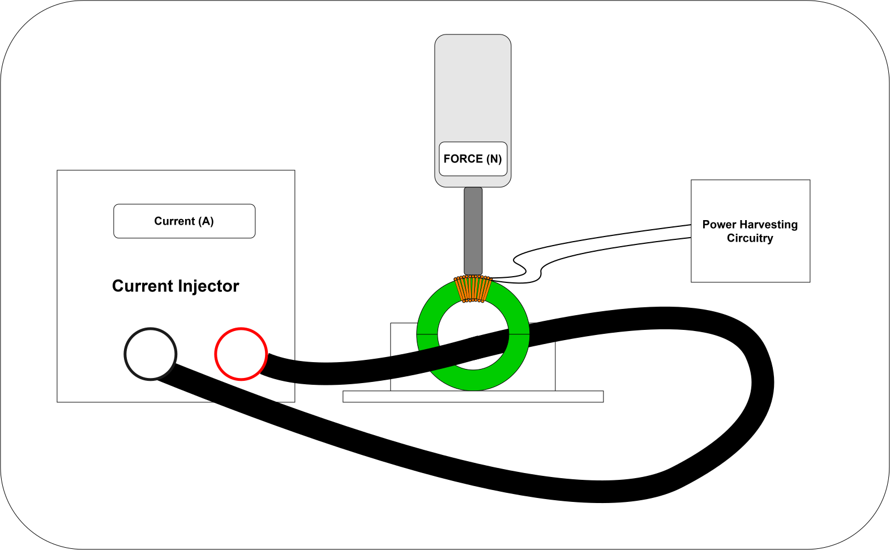
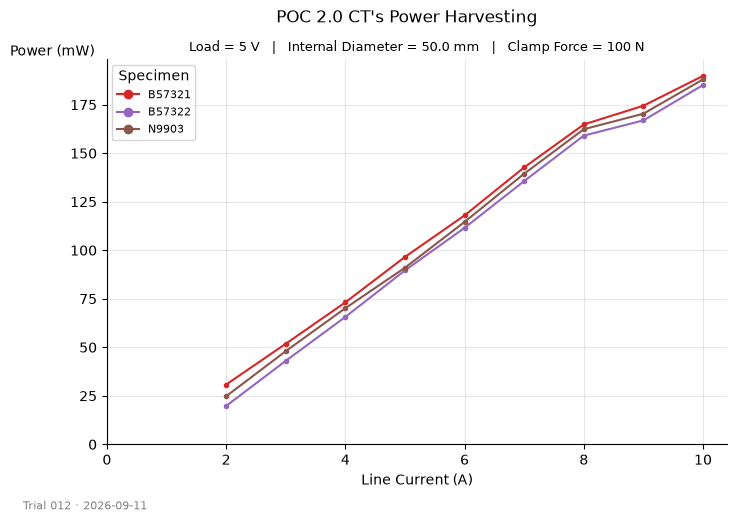

# ct-analysis

Reproducible pipeline for loading, validating and plotting current
transformer (CT) power-harvesting test data. Used for analysing how harvested
power responds to clamping force and line current across specimen
geometries and constructions.

<p align="center">
    
</p>

Analysis logic lives in `src/`, narrative and editorial decisions live
in the notebooks which read as standalone analyses.

## Example output

Power harvested rises linearly with line current, measured across three
POC 2.0 specimens at a fixed 100 N clamp force:

<p align="center">
    
</p>

Each line is one specimen the tight grouping shows consistent
harvesting across the sample. Generated by `compare_sweeps` see
`notebooks/02-current-response.ipynb`.

## Setup

```bash
python3 -m venv .venv
source .venv/bin/activate
pip install -r requirements.txt
```

## Data

Raw test data lives in `data/raw/` one CSV per trial
(`trial_NNN_YYYY-MM-DD.csv`). Each holds one or more sweeps, identified
by `specimen_id` and `replicate`.

Required columns: `test_date`, `specimen_id`, `replicate`, `force_N`,
`line_current_A`, `output_uA`, `load_V`. `power_mW` and `force_lbf` are
derived at load time.

Specimen attributes (`id_mm`, `material`, `batch`, `notes`) live in
`data/reference/specimens.csv` and are merged onto each trial by
`specimen_id`. Benchmark point-measurements load via `load_benchmarks()`
with a related schema (clamp method instead of a force sweep).

## Usage

```python
from ct_data import load_trial
from ct_plots import compare_sweeps

# force sweep
fig, ax = compare_sweeps(["003"])

# current sweep
fig, ax = compare_sweeps(["012"], x="line_current_A", xlabel="Line Current (A)")
```

## Structure

- `data/raw/` — raw trial CSVs
- `data/reference/specimens.csv` — specimen registry
- `src/ct_data.py` — loading, validation, derived columns
- `src/ct_plots.py` — reusable styled plotting
- `notebooks/01-force-response.ipynb` — force sweep analysis
- `notebooks/02-current-response.ipynb` — current sweep analysis
- `notebooks/exploratory/` — scratch work
- `figures/` — generated charts